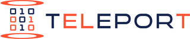
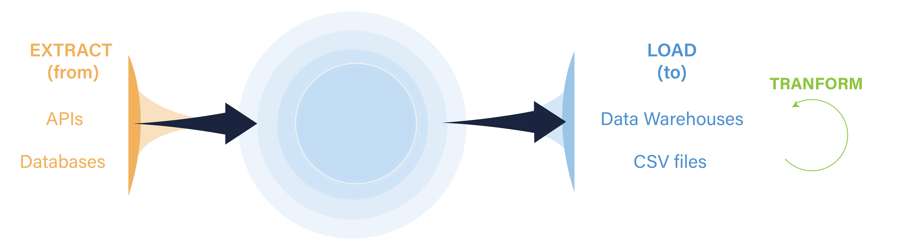

  One framework for all your data integration needs.

## Table of Contents

- [Introduction](#introduction)
- [Features](#features)
- [Supports](#supports)
- [Steps to Run a Data Extraction](#steps-to-run-a-data-extraction-job)
- [Documentation](#documentation)

## Introduction

  

Teleport's ambition is to become the standard for building ELT data ingestion pipelines. It provides an opionated, convention-over-configuration framework to allow you to pack your data warehouse, hydrate your data lake, or add a drop to your data pond from any or all of your 1st party and 3rd party data services.

Following the guidelines of ELT, Teleport does not provide support for complex, arbitrary data workflows. Instead, Teleport serves to provide just enough tooling and standardization to get all your data where it needs to go with the "EL" (extract-load) steps and moves all the complexity of preparing your data for business use to the "T" (transform) step.

## Features

* Setup connectors for extracting data from any API in minutes.
* Built-in connectors for extracting data from common relational databases.
* Minimal maintenance: one configuration file per data source and no external dependencies.
* Manage all data source and pipeline configurations in version control.
* Detailed logging for monitoring and debugging ELT pipelines.
* All commands available in a single Command Line Interface.

## Supports

<table style="width:100%">
  <tr>
    <th width=25% > 
 Data Sources 
 </th>
    <th width=25%> 
 Data Sinks 
 </th>
  </tr>
  <tr>
    <td  width=25%> 
 Any HTTP API
 </td>
    <td  width=25%> 
 CSV file 
 </td>
  </tr>
  <tr>
    <td width=25%> 
 Relational Databases: MySQL, PostgreSQL, SQLite 
 </td>
    <td width=25%> 
 Data Warehouses: AWS Redshift, Snowflake, PostgreSQL  
 </td>
  </tr>
</table>

## Steps to Run a Data Extraction Job
<ol>
  <li> <a href="https://github.com/hundredwatt/teleport/wiki/Teleport-Installation"> Install Teleport</a> (supported for Linux, macOS and Windows). </li>
  <li> Set up a <a href="https://github.com/hundredwatt/teleport/wiki/Creating-a-Teleport-Pad-Directory"> Teleport Pad</a> directory. </li>
  <li> Connect and configure data sources (i.e. 3rd-Party APIs and/or 1st-Party Databases).
  <li> Connect data sinks (i.e. Databases and/or Data Warehouses).
  <li> Run <a href="https://github.com/hundredwatt/teleport/wiki/Running-a-Data-Extraction-Job">Data Extraction Jobs</a> with Teleport.</li>
</ol>

## Documentation

Learn more about how to use Teleport in the Telport Wiki <a href="https://github.com/hundredwatt/teleport/wiki"> here </a>.

## Author

Jason Nochlin
* Twitter: @jasonnochin
* E-mail: jason (at) teleportdata.com
